# 今日から使えるITマメ知識
## Table of Contents
- [Table of Contents](#table-of-contents)
- [1. IME操作](#1-ime操作)
- [2. VS Code マルチカーソル](#2-vs-code-マルチカーソル)
  - [2.1 マルチカーソル操作](#21-マルチカーソル操作)
  - [2.2 マルチカーソル活用例：変数を辞書型に変換](#22-マルチカーソル活用例変数を辞書型に変換)
- [3. VS Code おすすめ拡張](#3-vs-code-おすすめ拡張)
  - [3.1 GitLens](#31-gitlens)
  - [3.2 EditorConfig for VS Code](#32-editorconfig-for-vs-code)
  - [3.3 Brackets Pair Colorizer2](#33-brackets-pair-colorizer2)
  - [3.4 autoDocstring](#34-autodocstring)
  - [3.5 Rainbow CSV](#35-rainbow-csv)
- [4. その他のショートカット](#4-その他のショートカット)
  - [4.1 エディタ](#41-エディタ)
  - [4.2 エディタグループ](#42-エディタグループ)
  - [4.3 検索中の操作](#43-検索中の操作)
  - [4.4 サイドバー](#44-サイドバー)

## 1. IME操作

---

文字変換中の操作をCtrl+英字キーで代替できる。
| 機能 | 一般的な操作 | Ctrl + 英字キー |
|:-----------|:------------|:------------
|全角ひらがなに変換|F6|Ctrl + `U`
|全角カタカナに変換|F7|Ctrl + `I`
|半角に変換|F8|Ctrl + `O`
|全角英数に変換|F9|Ctrl + `P`
|半角英数に変換|F10|Ctrl + `T`
|文節を縮める|Shift + ←|Ctrl + `K`
|文節を伸ばす|Shift + →|Ctrl + `L`
|文節を部分確定|Ctrl + Enter|Ctrl + `N`

## 2. VS Code マルチカーソル

---
VS Codeは編集画面のカーソルを増やして操作できる。  
置換と正規表現を使えば同じ事はできるが、数10行程度ならマルチカーソルを使った方が早いことが多い。

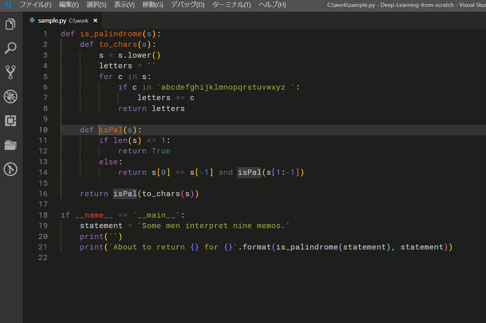

### 2.1 マルチカーソル操作
| 機能 | 操作 |
|:-----------|:------------
|同じ名前に1つずつカーソル追加|Ctrl + `D`
|現在選択中の名前に一致する次の名前にカーソル追加|Ctrl + `K`, Ctrl + `D`
|同じ名前に一括でマルチカーソル追加|Ctrl + Shift + `L`
|矩形選択|Ctrl + Shift + Alt + ↑ (or ↓ or → or ←)
|矩形選択(マウス)|Alt + Shift + 左ドラッグ
|上(下)の行にカーソル追加|Ctrl + Alt + ↑ (or ↓)
|任意の場所にカーソル追加|Alt + 左クリック
|選択範囲の行末にカーソル追加|Alt + Shift + `I`
|マルチカーソル解除|Esc

### 2.2 マルチカーソル活用例：変数を辞書型に変換
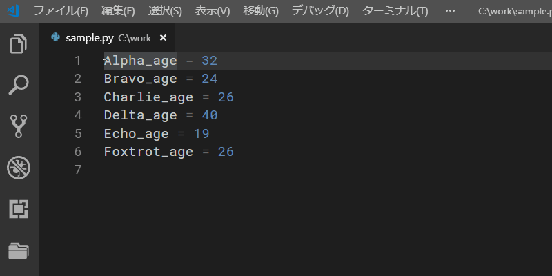

## 3. VS Code おすすめ拡張

---
### 3.1 GitLens
Gitのコミット間の差分を確認しやすくなる。

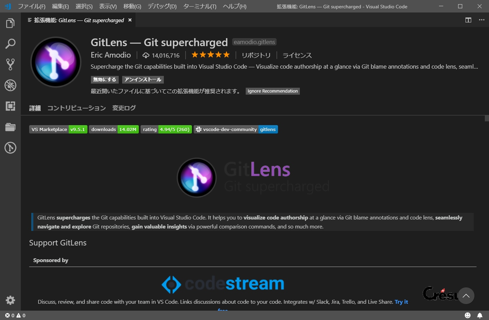

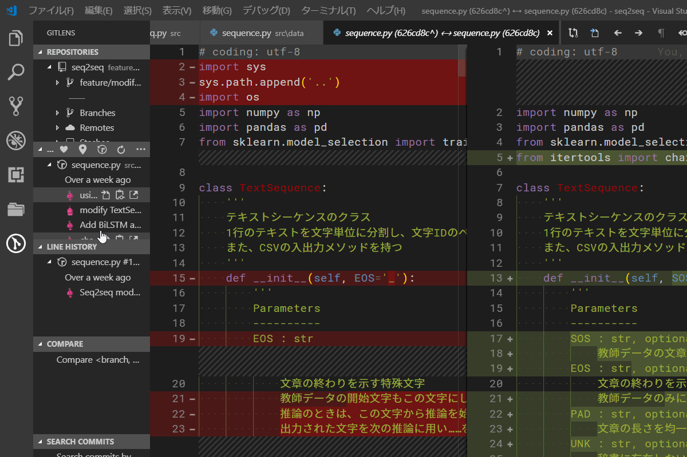

### 3.2 EditorConfig for VS Code
エディタの設定をファイル(`.editorconfig`)から読み込む。  
リポジトリのルートに置いておくことで、個々人が手動で設定を変える必要がなくなる。

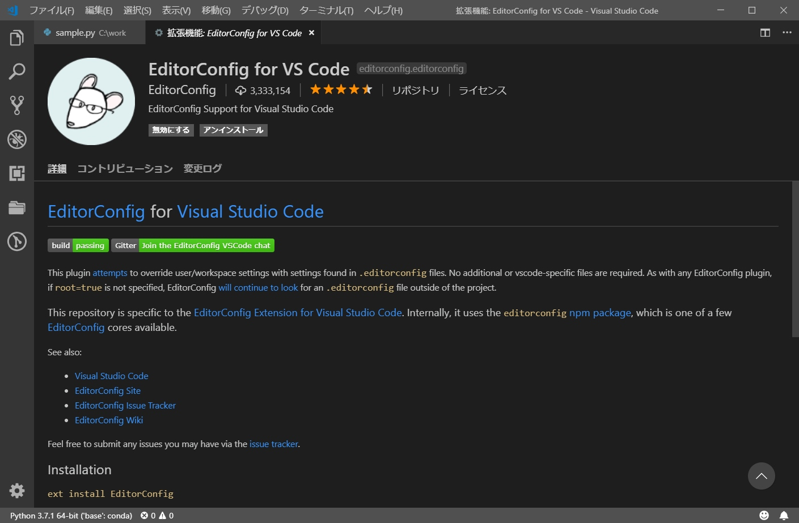

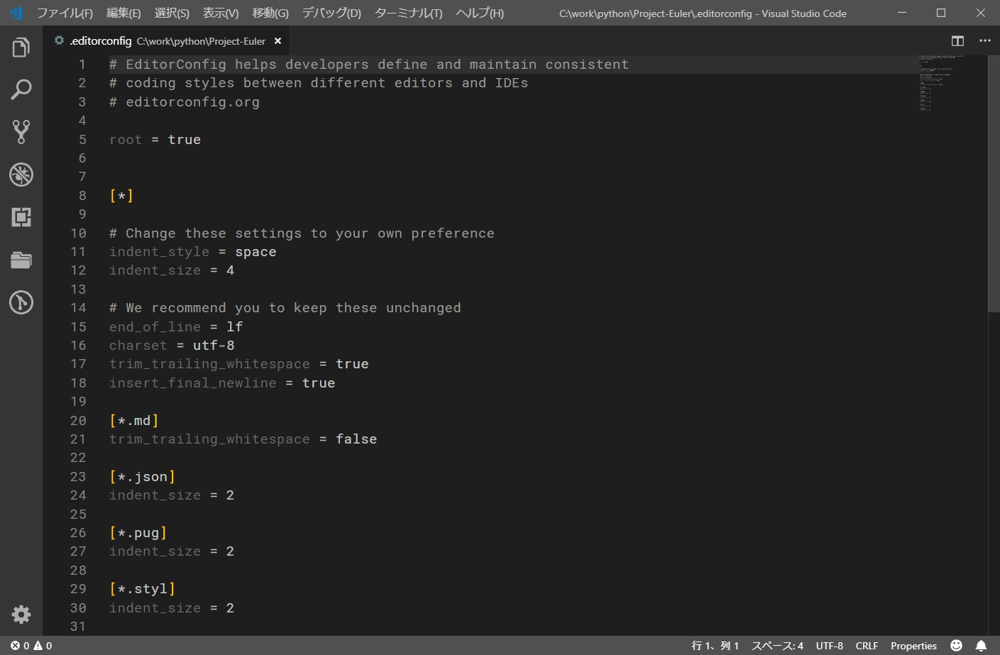

### 3.3 Brackets Pair Colorizer2
括弧に色を付けてスコープと入れ子構造を判別しやすくする。

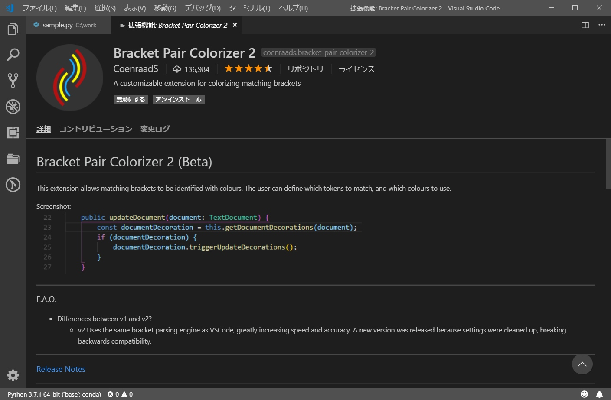

### 3.4 autoDocstring
docstringのテンプレートを生成する。引数や返り値を自動的に挿入してくれるので便利。

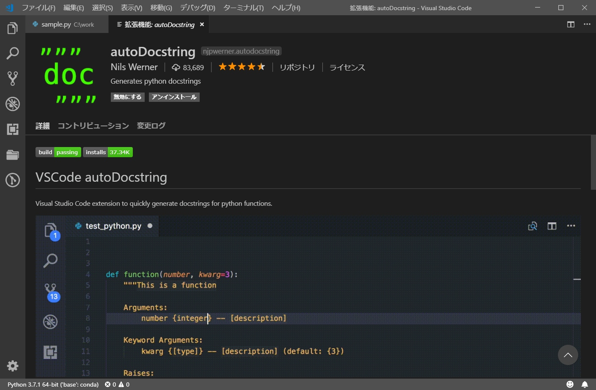

docstringのスタイルは設定で変更できる。以下の例はNumPyフォーマットを用いている：

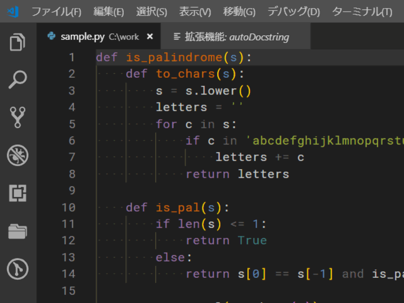

### 3.5 Rainbow CSV
CSVをカラム毎に色付けする。

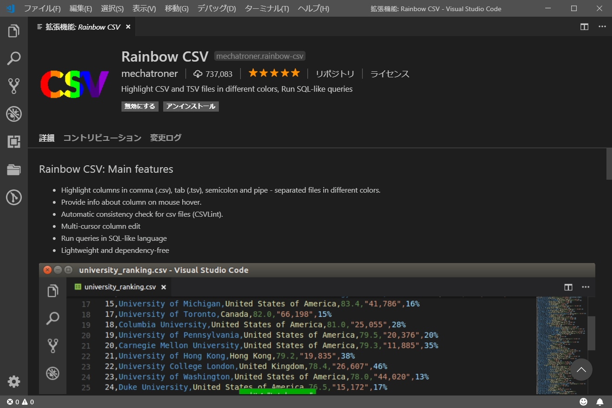

さらに、SQLライクな問い合わせ画面を呼び出し、データを抽出することもできる。

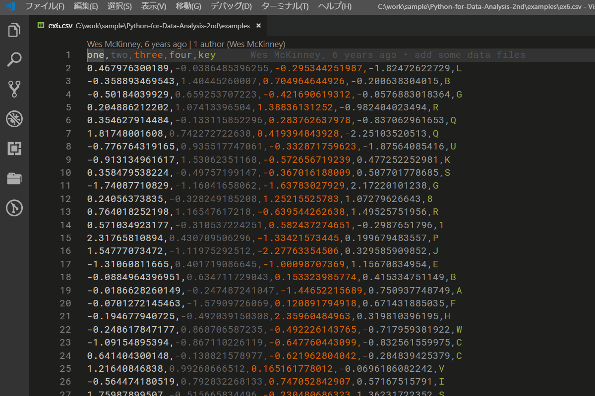

## 4. その他のショートカット

---

### 4.1 エディタ

| 機能 | 操作 |
|:-----------|:------------
|ファイルに移動(開く)| Ctrl + `P`
|コマンドパレットを開く| Ctrl + Shift + `P`
|ワード単位のカーソル移動|Ctrl + → (or ←)
|ワード単位の削除| Ctrl + Backspace (or Delete)
|行選択| Ctrl + `L`
|行の削除| Ctrl + Shift + `K`
|スマート選択| Ctrl + Alt + → (or ←)
|Breadcrumbsへフォーカス|Ctrl + Shift + `;`

### 4.2 エディタグループ

| 機能 | 操作 |
|:-----------|:------------
|新規のエディタを開く| Ctrl + `N`
|エディタを閉じる| Ctrl + `W`
|エディタグループをすべて閉じる| Ctrl + `K`, `W`
|エディタをすべて閉じる| Ctrl + `K`, Ctrl + `W`
|ウィンドウを閉じる|Ctrl + Shift + `W`
|閉じたエディタを開きなおす| Ctrl + Shift + `T`
|アクティブエディタのグループを移動|Ctrl + Alt + → (or ←)
|エディタグループの移動(画面分割の変更)|Ctrl + K,  ↑ (or ↓ or → or ←)
|アクティブグループにおけるエディタのフォーカス|Alt + `1` (or `2`, `3`, ...)
|エディタグループのフォーカス|Ctrl + `1` (or `2`, `3`, ...)

### 4.3 検索中の操作

| 機能 | 操作 |
|:-----------|:------------
|検索窓を開く/フォーカス/置換を閉じる| Ctrl + `F`
|検索窓の置換フィールドを開く/フォーカス切り替え| Ctrl + `H`
|検索窓を閉じる| Esc
|次の検索結果にジャンプ| `F3` or Enter(検索窓にフォーカス中)
|前の検索結果にジャンプ| Shift + `F3` or Enter(検索窓にフォーカス中)
|大文字小文字の区別切り替え| Alt + `C`
|単語単位検索の切り替え| Alt + `W`
|正規表現の切り替え| Alt + `R`

### 4.4 サイドバー

| 機能 | 操作 |
|:-----------|:------------
|サイドバーのトグル| Ctrl + `B`
|Quick Openビュー(サイドバー)| Ctrl + `Q`
|エクスプローラを開く| Ctrl + Shift + `E`
|ワークスペース検索を開く | Ctrl + Shift + `F`
|ソース管理を開く | Ctrl + Shift + `G`
|デバッグを開く | Ctrl + Shift + `D`
